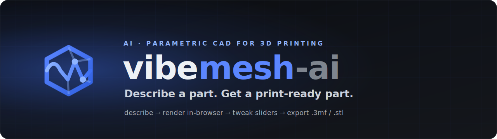
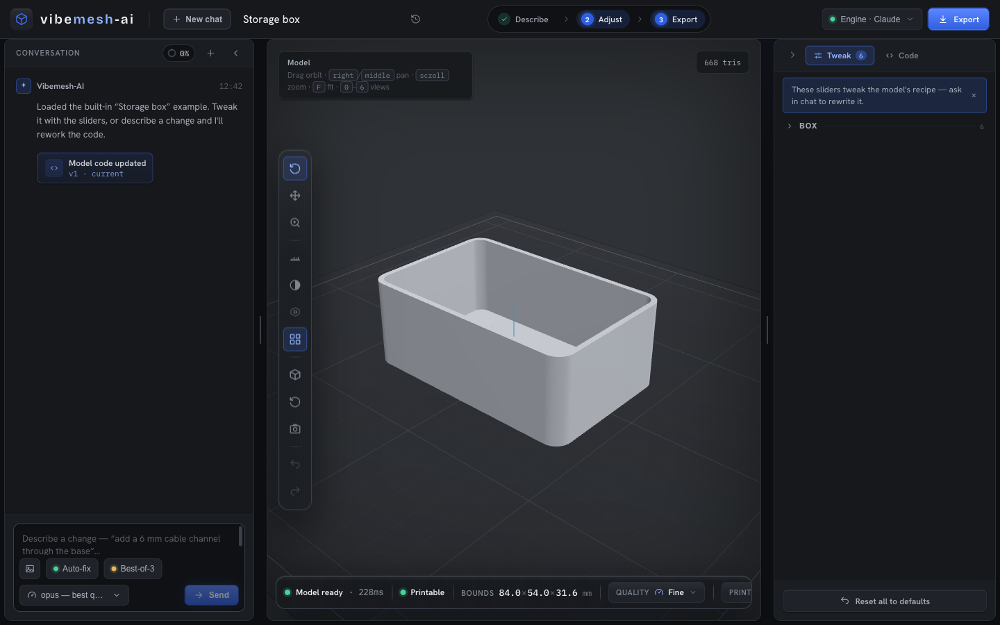
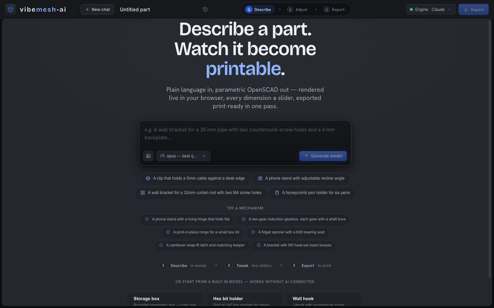
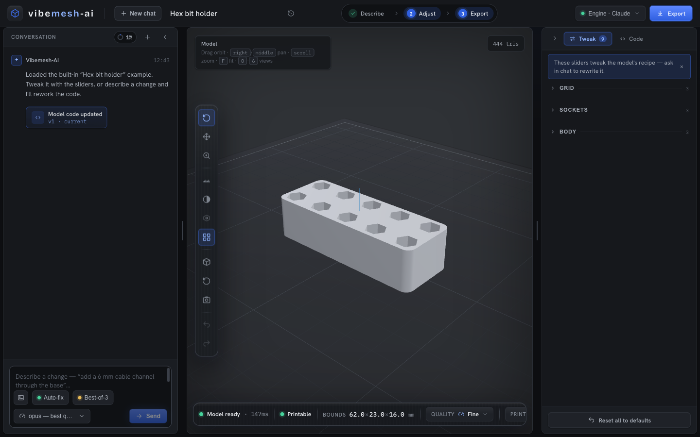

<div align="center">



### Describe a part in plain language. Get a parametric, print-ready 3D model — rendered entirely in your browser.

[](https://github.com/SherifMoShalaby/VibeMesh-AI/actions/workflows/ci.yml) [](https://github.com/SherifMoShalaby/VibeMesh-AI/actions/workflows/e2e.yml) [](https://github.com/SherifMoShalaby/VibeMesh-AI/actions/workflows/codeql.yml) [](LICENSE) [](package.json) [](CONTRIBUTING.md)

    

[**Features**](#-features) · [**Quickstart**](#-quickstart) · [**AI engines**](#-ai-engines) · [**How it works**](#-how-it-works) · [**Roadmap**](#-roadmap) · [**Contributing**](#-contributing)

</div>

<br>

<div align="center">
  
  <br>
  <sub><i>Chat on the left · live in-browser 3D viewport in the center · every dimension a slider on the right · one-click slicer-ready export.</i></sub>
</div>

<br>

**Vibemesh-AI** turns plain-language descriptions (optionally with reference photos) into **parametric OpenSCAD programs**, compiles them to geometry with `openscad-wasm` **directly in your browser**, exposes every dimension as a live slider, and exports slicer-ready files (`.3mf` / `.stl` / `.scad`). It's **local-first**: your projects and API keys live on your own machine — nothing renders in the cloud.

> [!NOTE]
> **Privacy.** Everything is local except the AI call itself. When you press **Send**, your prompt (and any attached reference images) goes to the **AI provider you picked** — Anthropic, Kimi, or your own local Ollama / LM Studio endpoint. Rendering, parameters and exports never leave the browser. **No analytics, no telemetry, no tracking** — see [SECURITY.md](SECURITY.md).

> [!TIP]
> **Origins.** Vibemesh-AI began as a quick experiment inspired by an existing text-to-CAD project (and was briefly named *"VibeSCAD"*). It has since been redesigned and rebuilt end-to-end — its own UX and design system, multi-engine AI integration, refine loop, viewport tooling and export pipeline — and is an independent product that does not track, share code with, or rely on any other codebase.

## ✨ Features

#### 🧠 Generate
- **Text → CAD** — the model writes complete, manifold, printability-aware OpenSCAD (flat base on the bed, mm units, minimum wall thickness, hardware clearances, self-supporting geometry preferences baked into the system prompt).
- **Image as prompt** — paste (⌘V), drag & drop, or attach photos / dimensioned sketches; send **image-only** (no text) and the AI models the part, honoring labeled dimensions exactly. A warning shows if the selected engine can't see images.
- **Mechanism-aware** — retrieved *skills* teach the model real mechanical patterns on demand: gears with backlash, living & print-in-place hinges, springs, cantilever snap-fits, bearing seats, and **heat-set / fastener clearances** from a single-source hardware catalog (M2–M6, 623–6000 bearings, each citing its ISO/DIN standard).
- **Best-of-N** — optionally fan out several candidates per prompt; each is compiled and scored by a reference-free verifier, and the best one is kept.

#### 🔧 Edit & iterate
- **Live parameters** — Customizer-style annotations parse into grouped sliders, dropdowns and checkboxes; changes re-render via OpenSCAD `-D` overrides in **~100–500 ms with no AI round-trip**.
- **Iterate by chat** — *"make the hook deeper"*, *"add a third screw hole"* — the AI returns the full updated program. Render errors get a one-click **Ask AI to fix** button.
- **Auto-refine** — image-grounded designs get automatic refinement passes that re-check the result against your reference and tighten the fit.

#### 👁 Render & inspect
- **In-browser geometry engine** — OpenSCAD compiled to WebAssembly runs in a Web Worker (fresh single-shot instance per render, watchdog respawn on hangs). No installs, no cloud.
- **Viewport tooling** — orbit / pan / zoom-to-cursor, move & rotate the part, **measure**, **X-ray** transparency, shading modes, orthographic toggle, BambuStudio-style `0–6` view hotkeys, and PNG snapshot.
- **Print-bed preview** — **15+ printer profiles** (Creality Ender 3 / K1, Bambu A1 / P1 / X1 / H2D, Prusa MK4S / CORE One / XL, Elegoo, Flashforge, QIDI, or a custom bed) with exceeds-bed / below-bed warnings and a live **printability verdict**.
- **Surface quality presets** — Draft / Standard / Fine / Ultra, implemented as adaptive `$fa`/`$fs` overrides so large curves smooth automatically while intentional low-poly features (`$fn=6` hex sockets) are preserved.

#### 📦 Export & share
- **Slicer-ready export** — one-click `.3mf` (every part a named object, arranged for Bambu Studio / PrusaSlicer / Orca), binary `.stl` (single or one-per-part), and `.scad` with your current slider values substituted.
- **Multi-part kits** — designs with a `part` enum get a **PARTS bar**, an `all` assembly preview, and per-piece compile + export.
- **`.vibemesh` share files** — a self-contained remix primitive (code + parameter values + applied patterns + thumbnail). Unlike a dead STL, the recipient re-drives the *same* Customizer sliders.
- **Local-first projects** — saved to **IndexedDB**, switchable, renameable, with per-message version history and rollback. Works fully offline.
- **Built-in examples** — storage box, hex bit holder, wall hook — fully usable **without an API key**.

## ⚡ Quickstart

```sh
npm install
npm run dev              # web on :5173, API on :5175
```

Then open **http://localhost:5173**.

No API key needed if you're already logged into Claude Code — the engine menu (next to **Send**) lists every connected engine. Even with no engine the app still runs: examples, sliders, code editing and STL export all work. (Requires **Node 20+**; dev is pinned to Node 22 via `.nvmrc`.)

<table>
<tr>
<td width="50%" valign="top">
  <br>
  <sub><b>Describe anything</b> — or start from a built-in model, no AI key required.</sub>
</td>
<td width="50%" valign="top">
  <br>
  <sub><b>Tune live</b> — grouped sliders re-render in milliseconds, no AI round-trip.</sub>
</td>
</tr>
</table>

## 🤖 AI engines

The server auto-detects what's available on your machine and the UI lets you switch **per message**:

| Engine | Auth | Setup |
|---|---|---|
| **Claude · login** | your Claude Code subscription login | install Claude Code, `claude` → `/login`. Nothing else. A model picker (default / opus / sonnet / haiku) appears next to the engine menu. |
| **Claude · API key** | `ANTHROPIC_API_KEY` in `.env` | key from [console.anthropic.com](https://console.anthropic.com) |
| **Kimi K2.6** | `KIMI_API_KEY` in `.env` | key from the Kimi Code console (included in the Kimi subscription). The CLI's `/login` token is tried automatically but Kimi's coding API currently rejects it. |
| **Local · model** | none | start Ollama (or LM Studio with `LOCAL_LLM_BASE_URL=http://localhost:1234`). Every installed model appears in the menu; vision models (qwen-vl, llava…) accept reference images. |

> [!IMPORTANT]
> **Heads-up for distribution:** Anthropic's Agent SDK terms do not allow third-party products to offer claude.ai subscription login to *their* users. The **Claude · login** engine is for personal / local use; a shipped product should use API keys (each user brings their own) or request approval from Anthropic. Kimi has no third-party OAuth either — console keys are the supported route.

Local models: 7B-class models produce simple parts fine but struggle with complex assemblies — `qwen2.5-coder:14b`+ via Ollama or Kimi K2.6 via API give noticeably better OpenSCAD.

### Production

```sh
npm run build
npm start                # serves dist/ + API on :5175
npm run preview          # optional: preview the built dist/ statically (no AI backend)
```

### Hosting

The frontend is fully client-side — examples, parameter sliders, in-browser openscad-wasm rendering, and STL/3MF/SCAD export all run with **no server**. So two deployment shapes are possible:

- **Static demo (e.g. GitHub Pages).** `npm run build` and serve `dist/` from any static host. Everything works *except* AI generation; the app detects the missing backend and shows a *"demo mode"* notice. A ready-to-use workflow lives at [.github/workflows/deploy.yml](.github/workflows/deploy.yml) — enable Pages (**Settings → Pages → GitHub Actions**) and it publishes on every push to `main`.
- **Full app (with AI).** Run `npm start` (or any Node host) so the Express server can dispatch to the AI engines. The server binds to `127.0.0.1` by default and has **no auth or rate limiting** — it's built for local single-user use. **Don't expose it directly to the public internet:** anyone who can reach it can spend your API keys. A multi-user hosted build should sit behind your own auth/proxy and switch to per-user API keys — the current `.env` model is single-tenant (local-first). See [SECURITY.md](SECURITY.md#self-hosting-note).

## 🛠 How it works

```
browser ─────────────────────────────────────────────
  React 19 + Vite + zustand + react-three-fiber
  ├─ ChatPanel ── SSE ──► Express (server/index.mjs)
  │                         └─ providers.mjs dispatch:
  │                             ├─ claude-code: @anthropic-ai/claude-agent-sdk (subscription login)
  │                             ├─ anthropic:   @anthropic-ai/sdk (API key, adaptive thinking, prompt cache)
  │                             ├─ kimi:        @anthropic-ai/sdk → api.kimi.com/coding (Anthropic-compatible)
  │                             └─ local:*      OpenAI-compatible /v1/chat/completions (Ollama / LM Studio)
  ├─ params.ts: Customizer annotation parser ─► sliders
  ├─ Web Worker: openscad-wasm ─► binary STL  (-D overrides for param changes)
  └─ react-three-fiber viewport: STLLoader ─► mesh + print-bed grid
```

**Two processes, one boundary:** the browser does *all* geometry work; the server only dispatches AI calls and serves the built frontend. The server never sees OpenSCAD code.

| Piece | Choice |
|---|---|
| Geometry engine | `openscad-wasm` (Manifold backend) in a Web Worker — fresh instance per render |
| AI | pluggable engines (table above), all streamed over one SSE protocol |
| Param round-trip | OpenSCAD `-D name=value` CLI overrides — no code rewrite, no AI call |
| Persistence | **IndexedDB** (`vibemesh` DB, ~GBs) behind a sync in-memory cache; small prefs + a migration backup in `localStorage` (legacy `vibescad.*` keys auto-migrated) |

A model-quality **benchmark + ratchet** (`bench/`) guards regressions: an engine × task matrix with voxel-IoU scoring against gold references, plus zero-API static guards for the skill/hardware/composition layers. See [CLAUDE.md](CLAUDE.md) and [docs/SPEC.md](docs/SPEC.md) for the deep dive.

## 🗺 Roadmap

- [ ] BOSL2 / MCAD library support (mount into the worker FS)
- [ ] Per-part print quantities (`wheel ×4`) baked into the 3MF
- [ ] Supabase auth + cloud project sync for sharing
- [ ] STL / STEP import as reference geometry

Have an idea? [Open an issue](https://github.com/SherifMoShalaby/VibeMesh-AI/issues) or start a discussion.

## 🤝 Contributing

Contributions are welcome! See [CONTRIBUTING.md](CONTRIBUTING.md) for dev setup, the build / lint / bench checks, and project layout. Please follow the [Code of Conduct](CODE_OF_CONDUCT.md). For security issues, see [SECURITY.md](SECURITY.md) (please don't open a public issue).

## 📄 License

[MIT](LICENSE) for Vibemesh-AI's own code. Vibemesh-AI bundles **OpenSCAD** (via `openscad-wasm`), which is **GPL-2.0**, invoked as a separate program — see [THIRD_PARTY_LICENSES.md](THIRD_PARTY_LICENSES.md) for what that means if you redistribute.

<div align="center">
<br>
<sub>Built for the 3D-printing community · <a href="https://github.com/SherifMoShalaby/VibeMesh-AI">star the repo</a> if it helped you ✦</sub>
</div>
